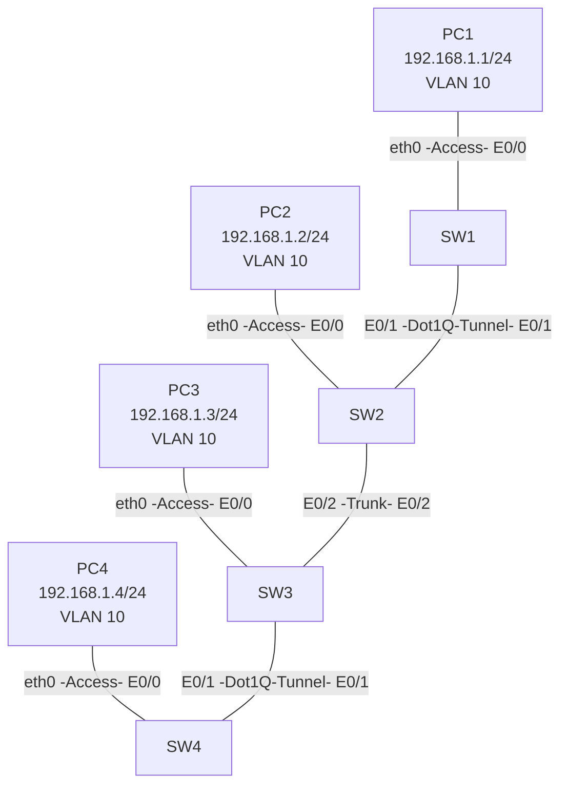
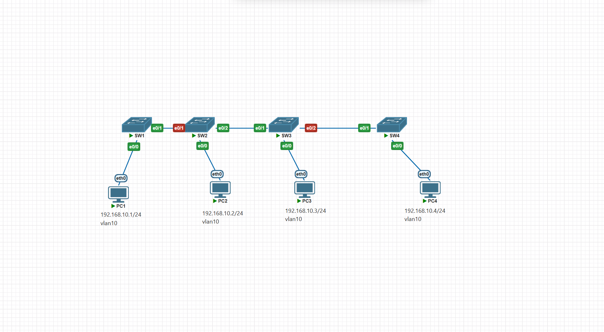

# 1.CCNP Enterprise作业一——交换基础

## 作业主题

交换基础

## 作业目标

1. VLAN 的规划与配置
2. Access 端口与 Trunk 端口的配置
3. 完成QinQ的配置

------

## 实验拓扑



## 需求

1. 根据实验拓扑完成设备连接与基础配置
2. 完成 PC1、PC2、PC3、PC4 的 IP 地址配置
3. 完成 VLAN 10 的创建与规划
4. 完成交换机 Access 端口配置
5. 完成交换机 Trunk 端口配置
6. 完成 Dot1Q Tunnel 端口配置
7. 完成 QinQ 配置

  

sw1
```
    !
    ! Last configuration change at 03:51:31 UTC Thu Sep 10 2026
    !
    version 15.2
    service timestamps debug datetime msec
    service timestamps log datetime msec
    no service password-encryption
    service compress-config
    !
    hostname SW1
    !
    boot-start-marker
    boot-end-marker
    !
    !
    !
    no aaa new-model
    !
    !
    !
    !
    !
    no ip icmp rate-limit unreachable
    !
    !
    !
    no ip domain-lookup
    ip cef
    no ipv6 cef
    !
    !
    !
    spanning-tree mode pvst
    spanning-tree extend system-id
    !
    !
    !
    !
    !
    !
    !
    !
    !
    !
    !
    !
    !
    !
    !
    interface Ethernet0/0
    no shutdown
    switchport access vlan 10
    switchport mode access
    !
    interface Ethernet0/1
    no shutdown
    switchport trunk encapsulation dot1q
    switchport mode trunk
    !
    interface Ethernet0/2
    no shutdown
    !
    interface Ethernet0/3
    no shutdown
    !
    interface Ethernet1/0
    no shutdown
    !
    interface Ethernet1/1
    no shutdown
    !
    interface Ethernet1/2
    no shutdown
    !
    interface Ethernet1/3
    no shutdown
    !
    interface Ethernet2/0
    no shutdown
    !
    interface Ethernet2/1
    no shutdown
    !
    interface Ethernet2/2
    no shutdown
    !
    interface Ethernet2/3
    no shutdown
    !
    interface Ethernet3/0
    no shutdown
    !
    interface Ethernet3/1
    no shutdown
    !
    interface Ethernet3/2
    no shutdown
    !
    interface Ethernet3/3
    no shutdown
    !
    ip forward-protocol nd
    !
    ip tcp synwait-time 5
    ip http server
    ip http secure-server
    !
    ip ssh server algorithm encryption aes128-ctr aes192-ctr aes256-ctr
    ip ssh client algorithm encryption aes128-ctr aes192-ctr aes256-ctr
    !
    !
    !
    !
    !
    control-plane
    !
    !
    line con 0
    exec-timeout 0 0
    privilege level 15
    logging synchronous
    line aux 0
    exec-timeout 0 0
    privilege level 15
    logging synchronous
    line vty 0 4
    login
    !
    !
    !
    end

```

sw2
```
        !
        ! Last configuration change at 03:51:31 UTC Thu Sep 10 2026
        !
        version 15.2
        service timestamps debug datetime msec
        service timestamps log datetime msec
        no service password-encryption
        service compress-config
        !
        hostname SW2
        !
        boot-start-marker
        boot-end-marker
        !
        !
        !
        no aaa new-model
        !
        !
        !
        !
        !
        no ip icmp rate-limit unreachable
        !
        !
        !
        no ip domain-lookup
        ip cef
        no ipv6 cef
        !
        !
        !
        spanning-tree mode pvst
        spanning-tree extend system-id
        !
        !
        ! 
        !
        !
        !
        !
        !
        !
        !
        !
        !
        !
        !
        !
        interface Ethernet0/0
        no shutdown
        switchport access vlan 10
        switchport mode access
        !
        interface Ethernet0/1
        no shutdown
        switchport access vlan 88
        switchport mode dot1q-tunnel
        no cdp enable
        !
        interface Ethernet0/2
        no shutdown
        switchport trunk encapsulation dot1q
        switchport mode trunk
        !
        interface Ethernet0/3
        no shutdown
        !
        interface Ethernet1/0
        no shutdown
        !
        interface Ethernet1/1
        no shutdown
        !
        interface Ethernet1/2
        no shutdown
        !
        interface Ethernet1/3
        no shutdown
        !
        interface Ethernet2/0
        no shutdown
        !
        interface Ethernet2/1
        no shutdown
        !
        interface Ethernet2/2
        no shutdown
        !
        interface Ethernet2/3
        no shutdown
        !
        interface Ethernet3/0
        no shutdown
        !
        interface Ethernet3/1
        no shutdown
        !
        interface Ethernet3/2
        no shutdown
        !
        interface Ethernet3/3
        no shutdown
        !
        ip forward-protocol nd
        !
        ip tcp synwait-time 5
        ip http server
        ip http secure-server
        !
        ip ssh server algorithm encryption aes128-ctr aes192-ctr aes256-ctr
        ip ssh client algorithm encryption aes128-ctr aes192-ctr aes256-ctr
        !
        !
        !
        !
        !
        control-plane
        !
        !
        line con 0
        exec-timeout 0 0
        privilege level 15
        logging synchronous
        line aux 0
        exec-timeout 0 0
        privilege level 15
        logging synchronous
        line vty 0 4
        login
        !
        !
        !
        end

```
sw3
```
        !
        ! Last configuration change at 04:09:10 UTC Thu Sep 10 2026
        !
        version 15.2
        service timestamps debug datetime msec
        service timestamps log datetime msec
        no service password-encryption
        service compress-config
        !
        hostname SW3
        !
        boot-start-marker
        boot-end-marker
        !
        !
        !
        no aaa new-model
        !
        !
        !
        !
        !
        no ip icmp rate-limit unreachable
        !
        !
        !
        no ip domain-lookup
        ip cef
        no ipv6 cef
        !
        !
        !
        spanning-tree mode pvst
        spanning-tree extend system-id
        !
        !
        ! 
        !
        !
        !
        !
        !
        !
        !
        !
        !
        !
        !
        !
        interface Ethernet0/0
        no shutdown
        switchport access vlan 10
        switchport mode access
        !
        interface Ethernet0/1
        no shutdown
        switchport trunk encapsulation dot1q
        switchport mode trunk
        !
        interface Ethernet0/2
        no shutdown
        switchport access vlan 88
        switchport mode dot1q-tunnel
        no cdp enable
        !
        interface Ethernet0/3
        no shutdown
        !
        interface Ethernet1/0
        no shutdown
        !
        interface Ethernet1/1
        no shutdown
        !
        interface Ethernet1/2
        no shutdown
        !
        interface Ethernet1/3
        no shutdown
        !
        interface Ethernet2/0
        no shutdown
        !
        interface Ethernet2/1
        no shutdown
        !
        interface Ethernet2/2
        no shutdown
        !
        interface Ethernet2/3
        no shutdown
        !
        interface Ethernet3/0
        no shutdown
        !
        interface Ethernet3/1
        no shutdown
        !
        interface Ethernet3/2
        no shutdown
        !
        interface Ethernet3/3
        no shutdown
        !
        ip forward-protocol nd
        !
        ip tcp synwait-time 5
        ip http server
        ip http secure-server
        !
        ip ssh server algorithm encryption aes128-ctr aes192-ctr aes256-ctr
        ip ssh client algorithm encryption aes128-ctr aes192-ctr aes256-ctr
        !
        !
        !
        !
        !
        control-plane
        !
        !
        line con 0
        exec-timeout 0 0
        privilege level 15
        logging synchronous
        line aux 0
        exec-timeout 0 0
        privilege level 15
        logging synchronous
        line vty 0 4
        login
        !
        !
        !
        end

    
```

sw4
```
    
        !
        ! Last configuration change at 03:51:33 UTC Thu Sep 10 2026
        !
        version 15.2
        service timestamps debug datetime msec
        service timestamps log datetime msec
        no service password-encryption
        service compress-config
        !
        hostname SW4
        !
        boot-start-marker
        boot-end-marker
        !
        !
        !
        no aaa new-model
        !
        !
        !
        !
        !
        no ip icmp rate-limit unreachable
        !
        !
        !
        no ip domain-lookup
        ip cef
        no ipv6 cef
        !
        !
        !
        spanning-tree mode pvst
        spanning-tree extend system-id
        !
        !
        ! 
        !
        !
        !
        !
        !
        !
        !
        !
        !
        !
        !
        !
        interface Ethernet0/0
        no shutdown
        switchport access vlan 10
        switchport mode access
        !
        interface Ethernet0/1
        no shutdown
        switchport trunk encapsulation dot1q
        switchport mode trunk
        !
        interface Ethernet0/2
        no shutdown
        !
        interface Ethernet0/3
        no shutdown
        !
        interface Ethernet1/0
        no shutdown
        !
        interface Ethernet1/1
        no shutdown
        !
        interface Ethernet1/2
        no shutdown
        !
        interface Ethernet1/3
        no shutdown
        !
        interface Ethernet2/0
        no shutdown
        !
        interface Ethernet2/1
        no shutdown
        !
        interface Ethernet2/2
        no shutdown
        !
        interface Ethernet2/3
        no shutdown
        !
        interface Ethernet3/0
        no shutdown
        !
        interface Ethernet3/1
        no shutdown
        !
        interface Ethernet3/2
        no shutdown
        !
        interface Ethernet3/3
        no shutdown
        !
        ip forward-protocol nd
        !
        ip tcp synwait-time 5
        ip http server
        ip http secure-server
        !
        ip ssh server algorithm encryption aes128-ctr aes192-ctr aes256-ctr
        ip ssh client algorithm encryption aes128-ctr aes192-ctr aes256-ctr
        !
        !
        !
        !
        !
        control-plane
        !
        !
        line con 0
        exec-timeout 0 0
        privilege level 15
        logging synchronous
        line aux 0
        exec-timeout 0 0
        privilege level 15
        logging synchronous
        line vty 0 4
        login
        !
        !
        !
        end


```

7. 验证 PC1、PC2、PC3、PC4 的连通性

    |       |  pc1  |  pc2  |  pc3  |  pc4  |
    | :---: | :---: | :---: | :---: | :---: |
    |  pc1  |       | 不通  | 不通  |  通   |
    |  pc2  | 不通  |       |  通   | 不通  |
    |  pc3  | 不通  |  通   |       | 不通  |
    |  pc4  |  通   | 不通  | 不通  |       |

8. 分析 PC1 与 PC4 的通信结果（二层帧交付过程）

    答： 能通信， pc1 通过access接口进入sw1打上vlan10标签(c-tag),在进过sw e0/2接口又被打上s-tag 88标签继续在trunk链路上传输，直到从sw3的e0/2接口出的时候，被剥离s-tag vlan88标签，再从sw4的e0/0的access接口出的时候，被剥离vlan10的标签

9. 分析PC1与PC2能否进行通信，如果可以描述过程，如果不可以请讲述理由
    不可以，sw2此时收到的包已经被打上了vlan88的标签，不识别内层的c-tag标签     