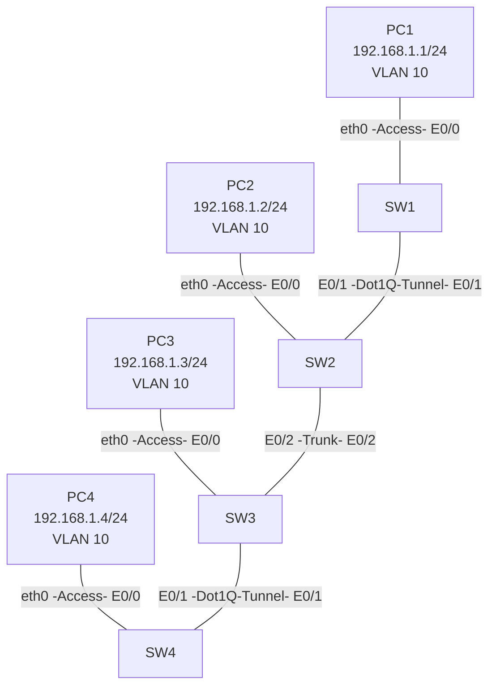

# 1.CCNP Enterprise作业一——交换基础

## 作业主题

交换基础

## 作业目标

1. VLAN 的规划与配置
2. Access 端口与 Trunk 端口的配置
3. 完成QinQ的配置

------

## 实验拓扑

## 需求

1. 根据实验拓扑完成设备连接与基础配置
2. 完成 PC1、PC2、PC3、PC4 的 IP 地址配置
3. 完成 VLAN 10 的创建与规划
4. 完成交换机 Access 端口配置
5. 完成交换机 Trunk 端口配置
6. 完成 Dot1Q Tunnel 端口配置
7. 完成 QinQ 配置
8. 验证 PC1、PC2、PC3、PC4 的连通性
9. 分析 PC1 与 PC4 的通信结果（二层帧交付过程）
10. 分析PC1与PC2能否进行通信，如果可以描述过程，如果不可以请讲述理由