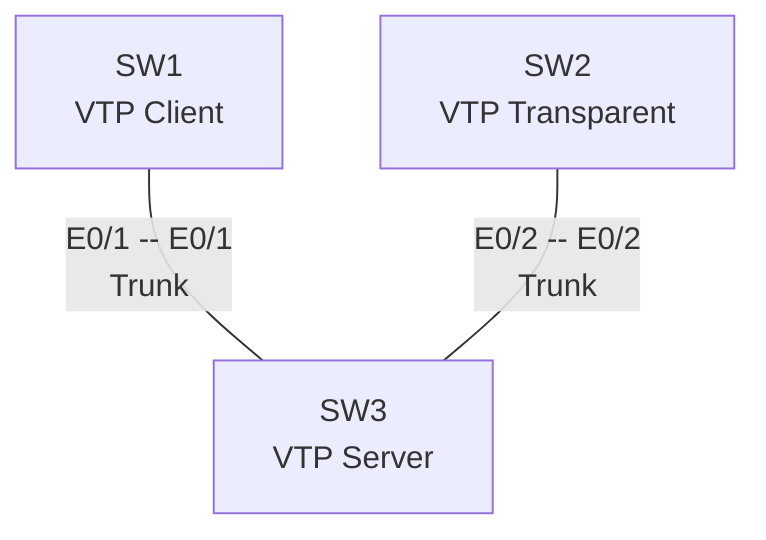
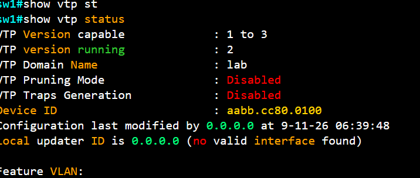
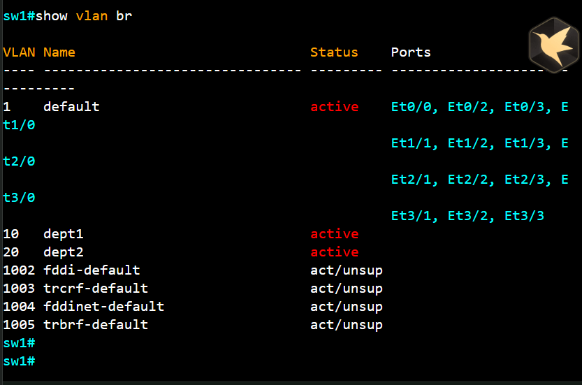
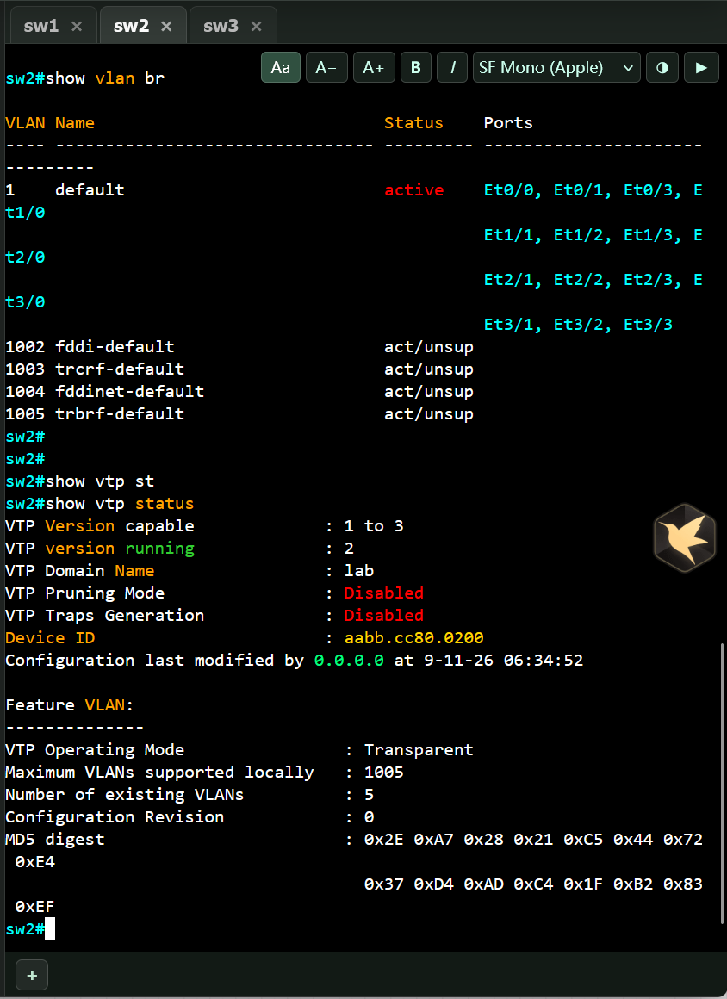
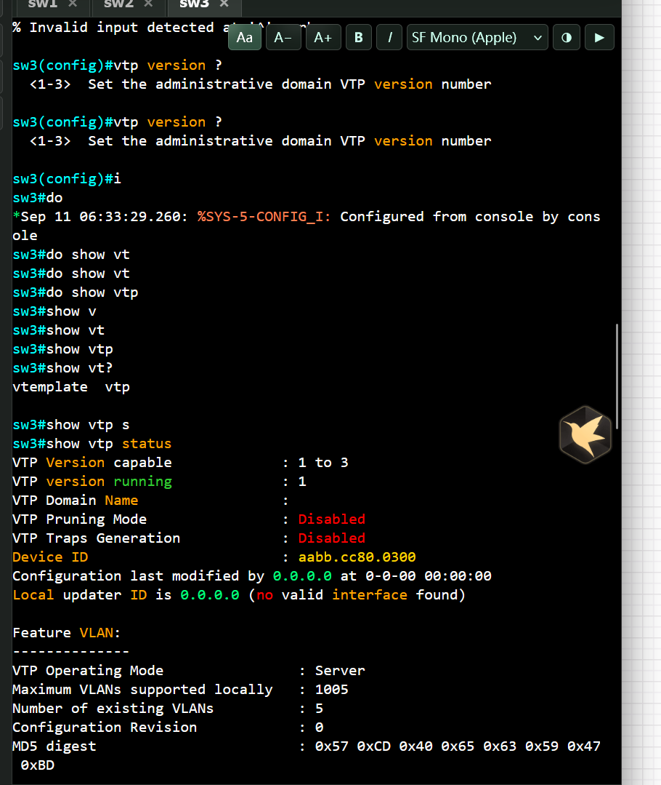

# 2.CCNP Enterprise作业二——VTP

## 作业主题

VTP

## 作业目标

1. 理解 VTP 的原理与配置



    SW1 -- "E0/1 -- E0/1<br>Trunk" --- SW3
    SW2 -- "E0/2 -- E0/2<br>Trunk" --- SW3
## 配置需求

1. SW1 为客户端模式、SW2 为透明模式、SW3 为服务器模式
2. 使用的是 VTP2，Domain 名称为 CCNP，密码为 Cisco
3. 请新增 VLAN 10、VLAN 20 来验证 VTP 是否配置成功

------

## 作业要求

1. 请给出最终配置，并按照设备进行分类
    **sw1**
   ```
    
    sw1(config)#vtp mode 
    sw1(config)#vtp mode ?
    client       Set the device to client mode.
    off          Set the device to off mode.
    server       Set the device to server mode.
    transparent  Set the device to transparent mode.
 
    sw1(config)#vtp domain lab
    Domain name already set to lab.
    sw1(config)#vtp password lab123
    Setting device VTP password to lab123

    sw1(config)#vtp mode server 
    Device mode already VTP Server for VLANS.
 
    sw1(config)#vtp version 2
    VTP version is already in V2.
   ```

   **sw2**
   ```
    sw2(config)#vtp version 2
    VTP version is already in V2.
    sw2(config)#vtp do
    sw2(config)#vtp domain lab
    Domain name already set to lab.
    sw2(config)#vtp pass
    sw2(config)#vtp password lab123
    Setting device VTP password to lab123
    sw2(config)#vtp  
    sw2(config)#vtp mod
    sw2(config)#vtp mode tr
    sw2(config)#vtp mode transparent 
    Setting device to VTP Transparent mode for VLANS.
   ```

   **sw2**

   ```
   sw3(config)#vtp version 2
    sw3(config)#vtp domain lab
    Changing VTP domain name from NULL to lab
    sw3(config)#
    *Sep 11 06:34:57.435: %SW_VLAN-6-VTP_DOMAIN_NAME_CHG: VTP domain name changed to lab.
    sw3(config)#vtp password
    sw3(config)#vtp password lab123
    Setting device VTP password to lab123
    sw3(config)#vtp mode ser
    sw3(config)#vtp mode server 
    Device mode already VTP Server for VLANS.
    sw3(config)#vlan 10
    sw3(config-vlan)#name dept1
    sw3(config-vlan)#vlan 20
    sw3(config-vlan)#name dept2
    sw3(config-vlan)#exit 
    sw3(config)#vlan 30 
    sw3(config-vlan)#name dept3
    sw3(config-vlan)#
   
   ```

2. 请给出现象验证截图

    sw3创建vlan10，20

    sw1无法本地创建vlan，但是可以同步到sw3 创建的vlan
    ,
    sw2 可以本地创建修改vlan，但是无法同步sw3创建的vlan，可以透传vtp报文

    sw3 可以本地创建修改vlan 并同步到vlan1
    