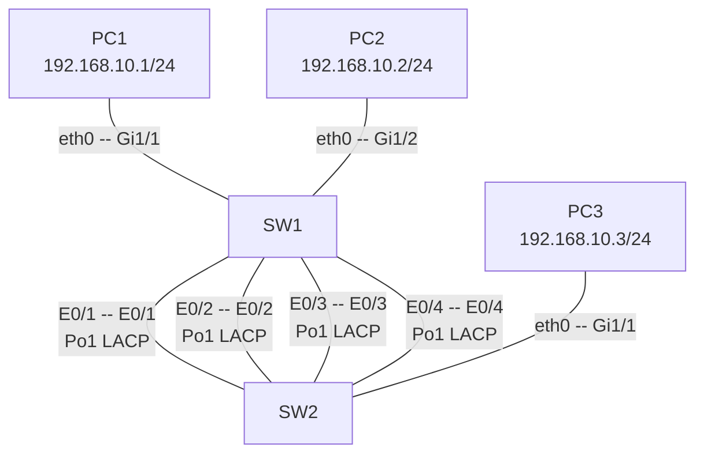
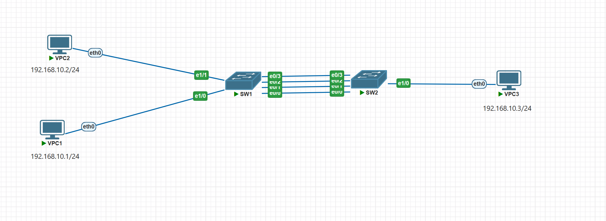
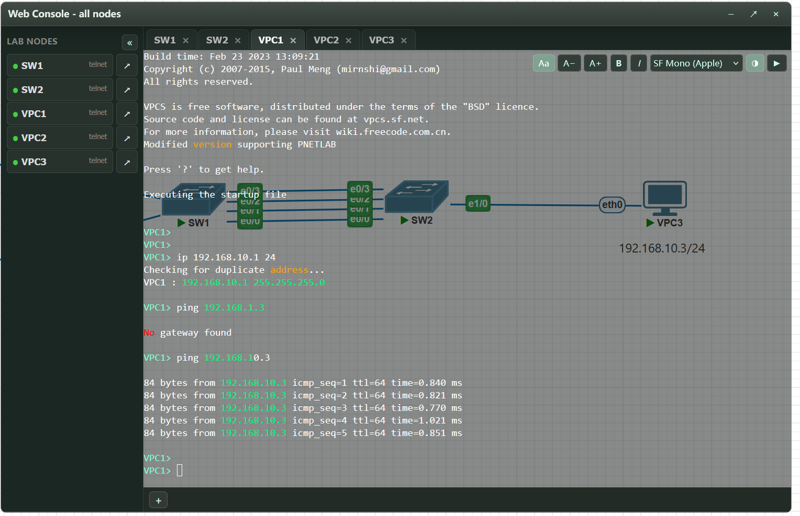

# 3.CCNP Enterprise作业三——EtherChannel

## 作业主题

EtherChannel

## 作业目标

1. 理解 EtherChannel 的原理与配置

------

## 实验拓扑



## 接口及 IP 地址规划

| 设备 | 接口           | 类型   | 规划                         |
| ---- | -------------- | ------ | ---------------------------- |
| SW1  | E0/1           | -      | channel-group 1 LACP Active  |
| SW1  | E0/2           | -      | channel-group 1 LACP Active  |
| SW1  | E0/3           | -      | channel-group 1 LACP Active  |
| SW1  | E0/4           | -      | channel-group 1 LACP Active  |
| SW1  | Port-Channel 1 | Trunk  | Allow VLAN 10                |
| SW1  | E1/1           | Access | VLAN 10                      |
| SW1  | E1/2           | Access | VLAN 10                      |
| SW2  | E0/1           | -      | channel-group 1 LACP Passive |
| SW2  | E0/2           | -      | channel-group 1 LACP Passive |
| SW2  | E0/3           | -      | channel-group 1 LACP Passive |
| SW2  | E0/4           | -      | channel-group 1 LACP Passive |
| SW2  | Port-Channel 1 | Trunk  | Allow VLAN 10                |
| SW2  | E1/1           | Access | VLAN 10                      |
| PC1  | eth0           | -      | 192.168.10.1/24              |
| PC2  | eth0           | -      | 192.168.10.2/24              |
| PC3  | eth0           | -      | 192.168.10.3/24              |

## 接口连接规划

| 设备 | 接口  | 连接设备 | 连接接口 |
| ---- | ----- | -------- | -------- |
| SW1  | E0/1  | SW2      | E0/1     |
| SW1  | E0/2  | SW2      | E0/2     |
| SW1  | Gi1/1 | PC1      | eth0     |
| SW1  | Gi1/2 | PC2      | eth0     |
| SW2  | E0/1  | SW1      | E0/1     |
| SW2  | E0/2  | SW1      | E0/2     |
| SW2  | Gi1/1 | PC3      | eth0     |

------

## 配置需求

1. 请按照所给出的接口连接规划和拓扑搭建实验，请根据接口及 IP 地址规划配置对应的 IP 和接口类型实现 EtherChannel

------

## 作业要求

1. 请给出最终配置，并按照设备进行分类
   **sw1**
```
SW1(config)#int r e0/0-3
SW1(config-if-range)#shutdown

SW1(config-if-range)#channel-gr
SW1(config-if-range)#channel-group 1 mode ac
SW1(config-if-range)#channel-group 1 mode active ?
SW1(config-if-range)#channel-group 1 mode active 
Creating a port-channel interface Port-channel 1

SW1(config-if-range)#no shutd
SW1(config-if-range)#no shutdown 
SW1(config-if-range)#exit

SW1(config)#int port-channel 1
SW1(config-if)#sw tr en
SW1(config-if)#sw tr encapsulation d
SW1(config-if)#sw tr encapsulation dot1q 
SW1(config-if)#sw mo tr 

SW1(config-if)#sw tr allowed vlan all
SW1(config-if)#end 
SW1#
*Sep 11 10:11:45.505: %SYS-5-CONFIG_I: Configured from console by console
SW1#conf t
Enter configuration commands, one per line.  End with CNTL/Z.
SW1(config)#int r e1/0-1
SW1(config-if-range)#sw mo ac
SW1(config-if-range)#sw ac vlan 10
% Access VLAN does not exist. Creating vlan 10

SW1#show etherchannel summary 
Flags:  D - down        P - bundled in port-channel
        I - stand-alone s - suspended
        H - Hot-standby (LACP only)
        R - Layer3      S - Layer2
        U - in use      N - not in use, no aggregation
        f - failed to allocate aggregator

        M - not in use, minimum links not met
        m - not in use, port not aggregated due to minimum links not met
        u - unsuitable for bundling
        w - waiting to be aggregated
        d - default port

        A - formed by Auto LAG


Number of channel-groups in use: 1
Number of aggregators:           1

Group  Port-channel  Protocol    Ports
------+-------------+-----------+-----------------------------------------------
1      Po1(SU)         LACP      Et0/0(P)    Et0/1(P)    Et0/2(P)    
                                 Et0/3(P)    
          
SW1#show in po
% Ambiguous command:  "show in po"
SW1#show in   
SW1#show int
SW1#show interfaces por
SW1#show interfaces port-c
SW1#show interfaces port-channel 1
Port-channel1 is up, line protocol is up (connected) 
  Hardware is EtherChannel, address is aabb.cc00.0100 (bia aabb.cc00.0100)
  MTU 1500 bytes, BW 40000 Kbit/sec, DLY 100 usec, 
     reliability 255/255, txload 1/255, rxload 1/255
  Encapsulation ARPA, loopback not set
  Keepalive set (10 sec)
  Full-duplex, Auto-speed, media type is RJ45
  input flow-control is off, output flow-control is unsupported 
  Members in this channel: Et0/0 Et0/1 Et0/2 Et0/3 
  ARP type: ARPA, ARP Timeout 04:00:00
  Last input 00:00:42, output never, output hang never
  Last clearing of "show interface" counters never
  Input queue: 0/2000/0/0 (size/max/drops/flushes); Total output drops: 0
  Queueing strategy: fifo
  Output queue: 0/40 (size/max)
  5 minute input rate 0 bits/sec, 0 packets/sec
  5 minute output rate 2000 bits/sec, 1 packets/sec
     6 packets input, 297 bytes, 0 no buffer
     Received 6 broadcasts (0 multicasts)
     0 runts, 0 giants, 0 throttles 
     0 input errors, 0 CRC, 0 frame, 0 overrun, 0 ignored
     0 input packets with dribble condition detected
     168 packets output, 28592 bytes, 0 underruns
     0 output errors, 0 collisions, 0 interface resets
     0 unknown protocol drops
     0 babbles, 0 late collision, 0 deferred
     0 lost carrier, 0 no carrier
     0 output buffer failures, 0 output buffers swapped out
SW1# 
```

**sw2**

```
W2(config)#int e1/0
SW2(config-if)#sw mo ac
SW2(config-if)#sw ac vl 10
% Access VLAN does not exist. Creating vlan 10
SW2(config-if)#int r e0/0-3
SW2(config-if-range)#shutdown

SW2(config-if-range)#cha
SW2(config-if-range)#channel-gr
SW2(config-if-range)#channel-group 1 mode ac
SW2(config-if-range)#channel-group 1 mode active 
Creating a port-channel interface Port-channel 1

SW2(config-if-range)#no shut
SW2(config-if-range)#no shutdown 
SW2(config-if-range)#exit
ype.
SW2(config)#int port-c
SW2(config)#int port-channel 
*Sep 11 10:13:22.252: %LINK-3-UPDOWN: Interface Port-channel1, changed state to up
*Sep 11 10:13:23.256: %LINEPROTO-5-UPDOWN: Line protocol on Interface Port-channel1, changed state to up
SW2(config)#int port-channel 1
SW2(config-if)#sw tr en do
SW2(config-if)#sw mo 
*Sep 11 10:13:29.273: %LINK-3-UPDOWN: Interface Port-channel1, changed state to down
*Sep 11 10:13:30.274: %LINEPROTO-5-UPDOWN: Line protocol on Interface Port-channel1, changed state to down
SW2(config-if)#sw mo tr
SW2(config-if)#sw tr al vl all
SW2(config-if)#
*Sep 11 10:13:34.796: %LINK-3-UPDOWN: Interface Port-channel1, changed state to up
*Sep 11 10:13:35.796: %LINEPROTO-5-UPDOWN: Line protocol on Interface Port-channel1, changed state to up
SW2(config-if)#end
SW2#show  
*Sep 11 10:13:41.378: %SYS-5-CONFIG_I: Configured from console by console
SW2#show  eth
SW2#show  etherc
SW2#show  etherchannel sum
SW2#show  etherchannel summary 
Flags:  D - down        P - bundled in port-channel
        I - stand-alone s - suspended
        H - Hot-standby (LACP only)
        R - Layer3      S - Layer2
        U - in use      N - not in use, no aggregation
        f - failed to allocate aggregator

        M - not in use, minimum links not met
        m - not in use, port not aggregated due to minimum links not met
        u - unsuitable for bundling
        w - waiting to be aggregated
        d - default port

        A - formed by Auto LAG


Number of channel-groups in use: 1
Number of aggregators:           1

Group  Port-channel  Protocol    Ports
------+-------------+-----------+-----------------------------------------------
1      Po1(SU)         LACP      Et0/0(P)    Et0/1(P)    Et0/2(P)    
                                 Et0/3(P)    
          
SW2#
```


2. 请给出连通性验证截图


3. 请比较 src-dst-ip 与 src-dst-mac 的负载均衡方式，请详细论述
    **src-dst-ip**:源 MAC + 目的 MAC进行hash，防止单一字段，流量全从一条链路上走
    
    **src-dst-mac**:源 IP + 目的 IP进行hash，成员链路更加均衡