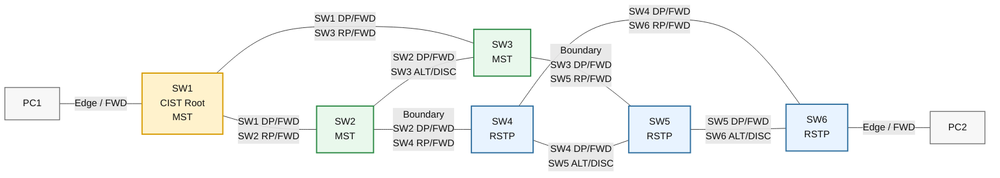

# 4.CCNP Enterprise作业四——STP 混合实验

## 作业主题

MST 与 RSTP 混合环境

## 作业目标

1. 理解 MST、RSTP 与 CIST 的关系
2. 掌握 MST Region 的基本规划与配置
3. 掌握 MST 与 RSTP 混合环境中的边界端口识别
4. 理解 Root Port、Designated Port、Alternate Port 的选举结果
5. 验证 STP/RSTP/MST 的防环与快速收敛效果

------

## 实验拓扑

## 接口及 IP 地址规划

| 设备 | 接口 | 类型   | 规划              |
| ---- | ---- | ------ | ----------------- |
| SW1  | E0/0 | Access | VLAN 10，连接 PC1 |
| SW1  | E0/1 | Trunk  | Allow VLAN 10、20 |
| SW1  | E0/2 | Trunk  | Allow VLAN 10、20 |
| SW2  | E0/1 | Trunk  | Allow VLAN 10、20 |
| SW2  | E0/2 | Trunk  | Allow VLAN 10、20 |
| SW2  | E0/3 | Trunk  | Allow VLAN 10、20 |
| SW3  | E0/1 | Trunk  | Allow VLAN 10、20 |
| SW3  | E0/2 | Trunk  | Allow VLAN 10、20 |
| SW3  | E0/3 | Trunk  | Allow VLAN 10、20 |
| SW4  | E0/1 | Trunk  | Allow VLAN 10、20 |
| SW4  | E0/2 | Trunk  | Allow VLAN 10、20 |
| SW4  | E0/3 | Trunk  | Allow VLAN 10、20 |
| SW5  | E0/1 | Trunk  | Allow VLAN 10、20 |
| SW5  | E0/2 | Trunk  | Allow VLAN 10、20 |
| SW5  | E0/3 | Trunk  | Allow VLAN 10、20 |
| SW6  | E0/1 | Trunk  | Allow VLAN 10、20 |
| SW6  | E0/2 | Trunk  | Allow VLAN 10、20 |
| SW6  | E0/3 | Access | VLAN 10，连接 PC2 |
| PC1  | eth0 | -      | 192.168.10.1/24   |
| PC2  | eth0 | -      | 192.168.10.2/24   |

## 接口连接规划

| 设备 | 接口 | 连接设备 | 连接接口 |
| ---- | ---- | -------- | -------- |
| PC1  | eth0 | SW1      | E0/0     |
| SW1  | E0/1 | SW2      | E0/1     |
| SW1  | E0/2 | SW3      | E0/1     |
| SW2  | E0/2 | SW3      | E0/2     |
| SW2  | E0/3 | SW4      | E0/1     |
| SW3  | E0/3 | SW5      | E0/1     |
| SW4  | E0/2 | SW5      | E0/2     |
| SW4  | E0/3 | SW6      | E0/1     |
| SW5  | E0/3 | SW6      | E0/2     |
| SW6  | E0/3 | PC2      | eth0     |

## STP 模式规划

| 设备 | STP 模式 | 角色规划        | 说明                  |
| ---- | -------- | --------------- | --------------------- |
| SW1  | MST      | CIST Root       | MST 区域核心根桥      |
| SW2  | MST      | MST 成员交换机  | 连接 MST 与 RSTP 区域 |
| SW3  | MST      | MST 成员交换机  | 连接 MST 与 RSTP 区域 |
| SW4  | RSTP     | RSTP 区域交换机 | 与 SW2 形成边界连接   |
| SW5  | RSTP     | RSTP 区域交换机 | 与 SW3 形成边界连接   |
| SW6  | RSTP     | RSTP 区域接入端 | 连接 PC2              |

## MST Region 规划

| 设备          | Region Name | Revision | MST 实例 | VLAN 映射 |
| ------------- | ----------- | -------- | -------- | --------- |
| SW1、SW2、SW3 | CCNP        | 1        | MSTI 1   | VLAN 10   |
| SW1、SW2、SW3 | CCNP        | 1        | MSTI 2   | VLAN 20   |

## CIST 端口角色预期

| 链路    | 本端角色     | 对端角色       | 说明             |
| ------- | ------------ | -------------- | ---------------- |
| PC1-SW1 | Edge / FWD   | -              | 接入终端链路     |
| SW1-SW2 | SW1 DP / FWD | SW2 RP / FWD   | SW2 到根桥路径   |
| SW1-SW3 | SW1 DP / FWD | SW3 RP / FWD   | SW3 到根桥路径   |
| SW2-SW3 | SW2 DP / FWD | SW3 ALT / DISC | MST 区域冗余链路 |
| SW2-SW4 | SW2 DP / FWD | SW4 RP / FWD   | Boundary 链路    |
| SW3-SW5 | SW3 DP / FWD | SW5 RP / FWD   | Boundary 链路    |
| SW4-SW5 | SW4 DP / FWD | SW5 ALT / DISC | RSTP 冗余链路    |
| SW4-SW6 | SW4 DP / FWD | SW6 RP / FWD   | SW6 到根桥路径   |
| SW5-SW6 | SW5 DP / FWD | SW6 ALT / DISC | RSTP 冗余链路    |
| SW6-PC2 | Edge / FWD   | -              | 接入终端链路     |

------

## 配置需求

1. 根据实验拓扑完成设备连接与基础配置
2. 按照规划表完成 PC1、PC2 的 IP 地址配置
3. 在 SW1、SW2、SW3、SW4、SW5、SW6 上创建 VLAN 10、VLAN 20
4. 将 SW1 的 E0/0 配置为 Access 端口并加入 VLAN 10
5. 将 SW6 的 E0/3 配置为 Access 端口并加入 VLAN 10
6. 将所有交换机互联端口配置为 Trunk，并只允许 VLAN 10、VLAN 20 通过
7. 将 SW1、SW2、SW3 配置为 MST 模式，并使用相同的 Region Name、Revision 和 VLAN 映射
8. 将 SW1 配置为 CIST Root，使 SW1 成为整个混合网络的根桥
9. 调整 SW2、SW3 的 STP 优先级，使 MST 区域内端口角色符合拓扑预期
10. 将 SW4、SW5、SW6 配置为 RSTP 模式，并调整优先级使 RSTP 区域端口角色符合拓扑预期
11. 验证 SW2-SW4、SW3-SW5 是否成为 MST 与 RSTP 的边界链路
12. 验证 PC1 与 PC2 是否可以正常通信
13. 关闭一条当前转发链路，观察 STP/RSTP/MST 的端口状态变化与收敛过程

------

## 作业要求

1. 请给出 SW1、SW2、SW3、SW4、SW5、SW6 的最终配置，并按照设备进行分类
2. 请给出 PC1、PC2 的 IP 地址配置结果
3. 请给出 MST Region 配置验证截图
4. 请给出 CIST Root 验证截图
5. 请给出各关键链路端口角色与端口状态的验证截图
6. 请给出 SW2-SW4、SW3-SW5 边界端口的验证截图
7. 请给出 PC1 与 PC2 连通性验证截图
8. 请说明 SW1 为什么会成为 CIST Root
9. 请说明 SW2-SW4、SW3-SW5 为什么是 Boundary 链路